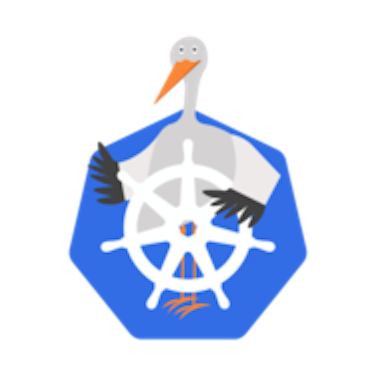

# Portworx Delivery (Food Delivery) Demo App

## Purpose:
The Portworx Delivery App is designed for demonstrating Portworx Data Services where you may need many different data services for your application to run correctly. 

## Background Story
The idea behind the inception of this applicaiton was to use this app as though we were owners of the Portworx Delivery Service company. This app mimics what many Portworx customers are dealing with and this app can be used to put our selves in our customer's shoes. Portworx Delivery Services is a complementary application alongside Portworx BBQ to help tell our story to customers.

## Application Architecture
This application consists of a web application running golang. The Authentication system for the food ordering site, uses a `MongoDB` database. The ordering system submits orders to a `Kafka` queue. In a real world environment many consumers may be listening to the Kafka topic for orders coming in. In our app, we created one of these consumers as an example, that reads the data from Kafka and pushes it to a `MySQL` database. Order history in the Portworx Delivery App, reads previous orders from the mysql database. An eample of the architecture can be found below.


</br>
</br>


# Deployment Instructions


This application requires data services to be deployed prior to deploying the application. Before deploying this application, use Portworx Data Services to deploy:
-  a Kafka Queue with `(3 nodes minimum)`
-  a MongoDB Database `(1 or more Nodes)`
-  a MySQL Database `(1 or more)` 
   
   The three data services should be deployed prior to the PX-Delivery Service and the Kafka Consumer pods. The application (PX-Delivery and Kafka Consumer) have logic to initialize the MongoDB database, Kafka topic, and MySQL Database. In order for the application to create new databases, new users, new permissions, etc, the data services must be deployed first, and then the applications.


Use the Connection information from PDS to fill out the environment variables in the Kubernetes YAML. If you're unsure which endpoint to use, choose one with `VIP` in the name.


## Option 1 - Helm Install
*Helm is the preferred installation method because connection strings must be coordinated across two microservices. Helm allows us to share a Values file, making deployment easier.*


To install via helm `cd` to the [helm](./deploy/helm/) directory.

Update the [Values.yaml](./deploy/helm/values.yaml) file with the connection information for the three data services.

#KAFKA CONNECTION</br>
`KAFKA_HOST`: "" #Required</br>
`KAFKA_PASS`: "" #Required</br>

#MYSQL CONNECTION</br>
`MYSQL_HOST`: "" #Required</br>
`MYSQL_INIT_PASS`: "" #Required</br>

#MONGODB CONNECTION</br>
`MONGO_HOST`: "" #Required</br>
`MONGO_INIT_PASS`: "" #Required</br>

<br>
Run the installer.
<br>

``` bash
helm install pxdelivery .
```

## Option 2 - Kubernetes Install
*If you would like to use Kubernetes YAML files, the process is slightly longer because environment variables must be copied multiple times.*

Once the data services have been deployed, you can use the Kubernetes manifests in the [Kubernetes](.deploy/kubernetes/) folder to deploy the applications.

Update the Kubernetes manifests with connection information for the `Kafka` instance, `MongoDB` database, and `MySQL` database. Specifically these environment variables:

`MONGO_INIT_USER` - PDS User used to create a new database. Default `pds`<br/>
`MONGO_INIT_PASS` - PDS Password for the MongoDB service <br/>
`MONGO_HOST` - Hostname or LoadBalancer of the MongoDB database<br/>
`MONGO_USER` - Custom Username for accessing MySQL. Default `porxie`<br/>
`MONGO_PASS` - Custom Password for accessing MySQL. Default `porxie`<br/>
`KAFKA_HOST` - Load Balancer DNS Name for the Kafka Cluster<br/>
`KAFKA_PORT` - Port used to access Kafka. PDS Default is `9092`<br/>
`MYSQL_INIT_USER` - PDS User used to create new databases. Default is `pds`</br>
`MYSQL_INIT_PASS` - PDS Password for the MySQL database. </br>
`MYSQL_HOST` - MYSQL DNS Address used to access the database<br/>
`MYSQL_USER` - Custom mysql user with access to the delivery database. Default `porxie`. This must match on both Kubernetes manifests.<br/>
`MYSQL_PASS` - Custom mysql password with access to the deliveyr database. Default `porxie`. This must match on both Kubernetes manifests.<br/>
`MYSQL_PORT` - Port for the mysql database. PDS default is `6446`.<br/>


Then run the manifests in numbered order. 

This will deploy:

- A namespace named `px-delivery`.
  
- Kafka Consumer that pulls from Kafka and pushes to MySQL. 
  > This part of the application initializes the MySQL database with a delivery database and the MYSQL_USER and MYSQL_PASS

- Portworx Delivery App (From Dockerhub) which uses MongoDB for auth. Pushes orders to Kafka, and reads order history from MySQL.
  > This part of the appliation initializes the MongoDB database with a delivery database and the MONGO_USER and MONGO_PASS. It also initializes the "order" topic in Kafka.

  > If any of the databases aren't initialized, try restarting the apps to get them to initialize the database.

## Access the App

Use the PX-Delivery Service to access the application. 

- Register a user and login. (MongoDB)
- Submit an Order (Kafka)
- Review Order History (MySQL)

